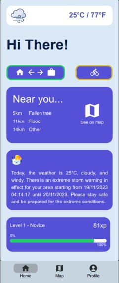
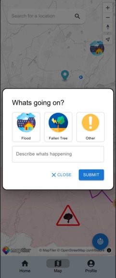
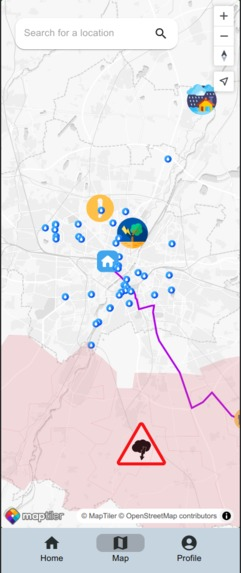

# Klima Hero

Klima Hero is a multi-platform mobile application born out of the urgency to address climate change. This project, developed during hackaTUM 2023 and sponsored by the "Landeshauptstadt München Challenge," focuses on collaborative weather incident reports to empower both citizens and city authorities in preventing further damage.

## Project Overview

Klima Hero is a multi-platform mobile application designed for collaborative weather incident reporting. Citizens and city authorities can use the app to report weather incidents and collectively contribute to mitigating the impact of climate change.

## How We Built It

We built both the backend and frontend from scratch:

- **Backend**: Programmed in Python, the backend runs a FastAPI server serving data from an SQLite database. Public APIs like [Bright Sky](https://brightsky.dev/) were utilized for data retrieval.

- **Frontend**: Developed with React Native, the frontend presents data from the backend in a user-friendly manner. The app's map functionality is powered by [MapTiler](https://www.maptiler.com/), which consumes OpenStreetMap data.

## Contributors

This project was made possible through the collaborative efforts of the following individuals:
- [Diego Miguel](https://github.com/dmlls)
- [Johannes Getzner](https://github.com/JohannesGetzner)
- [Mariz Samir Awad](https://github.com/marzi333)
- [Peter Fam](https://devpost.com/peter-fam)

### Screenshots

 |  | 
